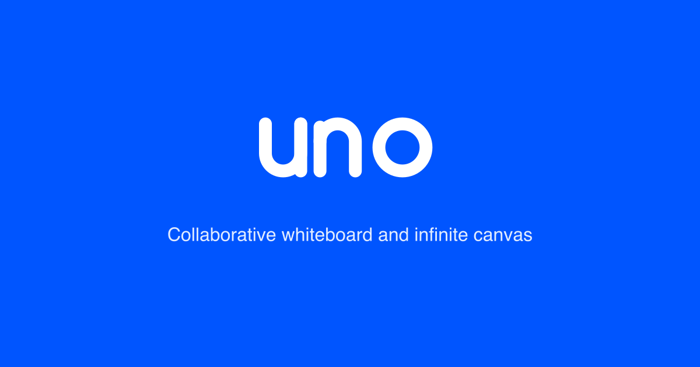
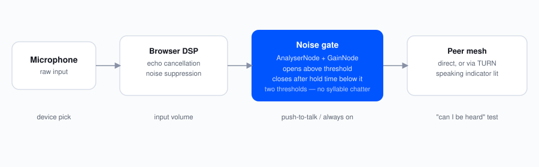
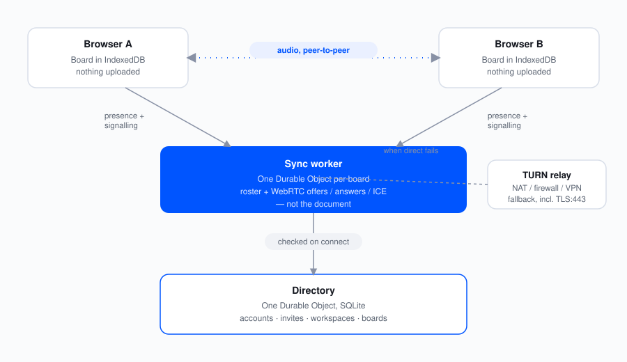

<p align="center">
  
</p>

<h1 align="center">UnoCode</h1>

<p align="center">
  A collaborative whiteboard where the documents live on the canvas.
</p>

<p align="center">
  <a href="#features">Features</a> ·
  <a href="#getting-started">Getting started</a> ·
  <a href="#architecture">Architecture</a> ·
  <a href="#project-layout">Layout</a> ·
  <a href="./DEPLOYMENT.md">Deploying</a>
</p>

---

UnoCode is an infinite canvas for working together: draw, drop in files, read and edit them in
place, and talk to the people on the board without leaving it. It is built on the
[tldraw SDK](https://tldraw.dev), which provides the canvas engine — shapes, tools, geometry,
rendering — while everything above it is specific to this project.

There is no sign-up: the only way in is an invite link. Opening one asks for a name and an email —
the name is what appears next to your cursor when someone else is on the board with you, the email
is what makes a second invite land on the same person. Without a link there is nothing to see.

## Features

### Boards and workspaces

Boards are grouped into workspaces, and one administrator creates, renames and deletes both. Each
board keeps its own document, so switching between them never mixes their contents.

### Invites

Access is a link and nothing else. The administrator mints one for a workspace — which carries
every board in it, including ones added later — or for a single board, and whoever opens it gives
a name and an email and is in. One person can hold invites to several workspaces and boards, and
the same email joining twice is the same person, not a second one.

Taking access away takes effect at once: the board leaves their sidebar, its contents are deleted
from their browser, and if they are on it when it happens, the session and the call they are in end
with it. A link that has spread further than intended can be revoked without disturbing anyone who
already used it.

Deleting a board is reversible for a week: it leaves the workspace immediately, and a week later
it and everything stored for it — its document, edit history, thumbnail and uploaded images — are
deleted for good. Deleting a workspace does the same to every board in it. Images deleted from a
board are removed from storage on the same schedule, so undo keeps working in the meantime.

### Voice chat

Talk to the other people on a board over a peer-to-peer connection.

<p align="center">
  <picture>
    <source media="(prefers-color-scheme: dark)" srcset="./assets/voice-pipeline-dark.svg" />
    
  </picture>
</p>

- **Push to talk** or **always on**, whichever suits the room
- A **noise gate** at three levels, with hysteresis and a hold time so it doesn't clip the quiet
  parts of a sentence, plus an input volume control
- Microphone and speaker selection, and a "can I be heard" test that records a few seconds and
  plays them back
- A speaking indicator on each avatar, so it's clear who is talking

### Presence

The header shows who is on the board and how many, as a stack of avatars — the arrangement Google
Docs uses, for the same reason: the count matters at a glance, the names only on demand.

### Documents on the canvas

Drop a file onto the board and it becomes a card you can open.

| Format  | Viewing                                                 | Editing                                             |
| ------- | ------------------------------------------------------- | --------------------------------------------------- |
| `.docx` | Rendered as a page — headings, lists, tables and images | Edit the document in place, download a real `.docx` |
| `.md`   | Rendered, not shown as source                           | Edit and download                                   |
| `.txt`  | As written                                              | Edit and download                                   |
| `.json` | Syntax highlighted, with line numbers                   | —                                                   |
| `.pdf`  | The browser's own viewer                                | —                                                   |
| `.xlsx` | First sheet as a table                                  | —                                                   |

Images, video and audio get players of their own, and dropping several files at once lays them out
in a row rather than stacking them in one spot.

## Getting started

Requires Node `>=22.12.0`. Enable Corepack, then install:

```bash
npm i -g corepack && yarn
```

Two processes: the client, and the worker that carries presence and voice signalling.

```bash
yarn workspace dotcom dev
```

```bash
yarn workspace @tldraw/dotcom-worker dev
```

The app is then at [localhost:3000](http://localhost:3000). Both are also in
`.claude/launch.json` as `unocode-client` and `unocode-sync-worker`.

Voice chat needs a secure context, which is what browsers require before they hand over a
microphone. `localhost` counts; a plain `http://` address on the local network does not, so use an
https tunnel when testing with someone on another machine.

To host it somewhere other than your own machine, see [DEPLOYMENT.md](./DEPLOYMENT.md).

## Architecture

<p align="center">
  <picture>
    <source media="(prefers-color-scheme: dark)" srcset="./assets/architecture-dark.svg" />
    
  </picture>
</p>

**Local-first boards.** A board's contents live in the browser's own IndexedDB, keyed by the board
id. Nothing is uploaded, and nothing is lost when the network is: work stays put until it is
deleted or the browser's site data is cleared.

**One directory.** What _is_ on the server is the account system: who has been invited, which
workspaces and boards they may open, and the links that got them there. It is a single Durable
Object with a SQLite database — no Postgres, no identity provider — and it is what every presence
socket is checked against, so a board id is no longer a capability. The one administrator account
is fixed in code and proved with a secret the worker is deployed with.

**A live session per board.** What is shared is who is present and their audio, not the document.
A Durable Object in the sync worker holds one room per board id: it keeps the roster and relays
WebRTC offers, answers and ICE candidates between browsers. Audio then flows peer to peer over a
mesh, so it never passes through the server.

**Getting connected.** Peer to peer is the goal, not a guarantee: symmetric NAT, a firewall that
drops UDP and most VPNs all need a relay. Each session is handed TURN credentials alongside the
roster, so those networks fall back to a relay — including over TLS on port 443, which is the one
route that survives a restrictive network — while everyone else stays direct. Which relay is
configuration rather than code, so it can be a hosted one or a self-hosted coturn. A connection
that breaks mid-call (a VPN coming up or going down is the usual cause) is repaired with an ICE
restart, which keeps the call rather than dropping it.

**Voice pipeline.** The microphone goes through the browser's own echo cancellation and noise
suppression, then through a gate built from an `AnalyserNode` and a `GainNode`: it opens above one
threshold and only closes once the level has stayed below a lower one for the hold time. Two
thresholds rather than one, because a single one chatters on every syllable boundary.

## Project layout

Built on the tldraw monorepo, so the canvas engine sits alongside the app in one workspace.

| Path                      | What it is                                                          |
| ------------------------- | ------------------------------------------------------------------- |
| `apps/dotcom/client`      | The app: boards, presence, voice chat, document viewer and editor   |
| `apps/dotcom/sync-worker` | Cloudflare worker; hosts the presence and signalling Durable Object |
| `packages/editor`         | tldraw's canvas engine — geometry, rendering, the editor API        |
| `packages/tldraw`         | tldraw's default shapes, tools and UI                               |
| `packages/*`              | The rest of the SDK: store, schema, state, sync, utilities          |

Most of the project's own code is under `apps/dotcom/client/src/tla`.

## Commands

| Command          | What it does                 |
| ---------------- | ---------------------------- |
| `yarn typecheck` | Type check every package     |
| `yarn lint`      | Lint                         |
| `yarn test run`  | Run tests (from a workspace) |
| `yarn build-app` | Build the client             |

## Built on tldraw

The canvas comes from the [tldraw SDK](https://tldraw.dev), and this repository began as a fork of
the [tldraw monorepo](https://github.com/tldraw/tldraw). It does not track upstream: the SDK is a
starting point, and everything above the canvas is this project's own.

The SDK is used under the [tldraw license](./LICENSE.md), which is included in full. The watermark
the SDK renders is part of that license; it is removed with a license key from
[tldraw.dev](https://tldraw.dev), not by editing it out.
